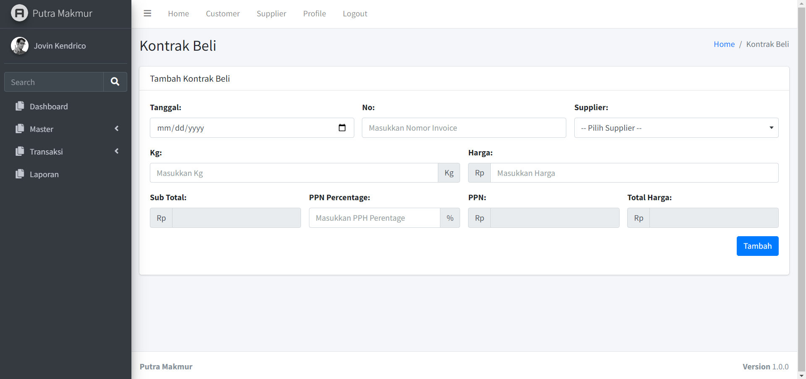

### Aplikasi Untuk Transaksi Pembelian dan Penjualan Cangkang Sawit 

---

**Anggota:**
1. Jovin Kendrico
2. Winar Joko Alexander
3. Aditya Kristianto

## Fitur
- Master
> 1. Master Armada
>>> Master armada adalah fitur untuk melakukan operasi CRUD pada armada
> 2. Master Customer
>>> Master Customer adalah fitur untuk melakukan operasi CRUD pada customer
> 3. Master Supplier
>>> Master Supplier adalah fitur untuk melakukan operasi CRUD pada supplier
> 4. Master Supir
>>> Master Supir adalah fitur untuk melakukan operasi CRUD pada supir
- Transaksi
> 1. Kontrak Beli
>>> Kontrak Beli adalah fitur untuk melakukan operasi CRUD terhadap kontrak beli, dimana fitur ini digunakan sebagai alat untuk membuat transaksi kontrak beli cangkang sawit dari supplier
> 2. Kontrak Jual
>>> Kontrak Jual adalah fitur untuk melakukan operasi CRUD terhadap kontrak jual, dimana fitur ini digunakan sebagai alat untuk membuat transaksi kontrak jual cangkang sawit kepada customer
> 3. Muat Bongkar
>>> Muat Bongkar adalah fitur untuk melakukan operasi CRUD terhadap muat bongkar, dimana fitur ini digunakan sebagai alat untuk membuat muat bongkar dari kontrak beli dan kontrak jual yang telah ada, dimana fitur ini juga harus mengikutsertakan supir dan armada dari transaksi muat bongkar
- Laporan
> 1. Laporan Muat Bongkar
>>> Laporan Muat Bongkar adalah fitur untuk menyeleksi laporan muat bongkar yang kita inginkan yang dapat difilter berdasarkan supir, nomor kontrak, armada, dan tanggal
> 2. Laporan Keuntungan
>>> Laporan Keuntungan adalah fitur untuk  laporan keuntungan dari kontrak jual beli yang telah dilakukan muat bongkar dimana laporan ini dapat difilter berdasarkan tanggal dan nomor kontrak
> 3. Laporan Gaji Armada Supir
>>> Laporan Gaji Armada Supir adalah fitur untuk generate laporan dari gaji armada supir yang telah melakukan muat bongkar.

## Flow Aplikasi
1. Buat Data Master Supplier
2. Buat Data Master Customer
3. Buat Transaksi Kontrak Beli dengan supplier berdasarkan nominal MT atau harga tertentu
3. Buat Transaksi Kontrak Jual dengan customer berdasarkan nominal MT atau harga tertentu
4. Buat Data Master Supir
5. Buat Data Master Armada
6. Buat Transaksi Muat Bongkar yang didasarkan oleh kontrak beli dan kontrak jual dimana disini juga ditetapkan berapa ongkos yang diberikan kepada armada dan serta adanya potongan apabila terdapat susut dalam perjalanan
7. Buat Laporan berdasarkan laporan apa yang kita inginkan
   
## Use Case Diagram

## Design Database

## Mockup
<<<<<<< HEAD

=======

